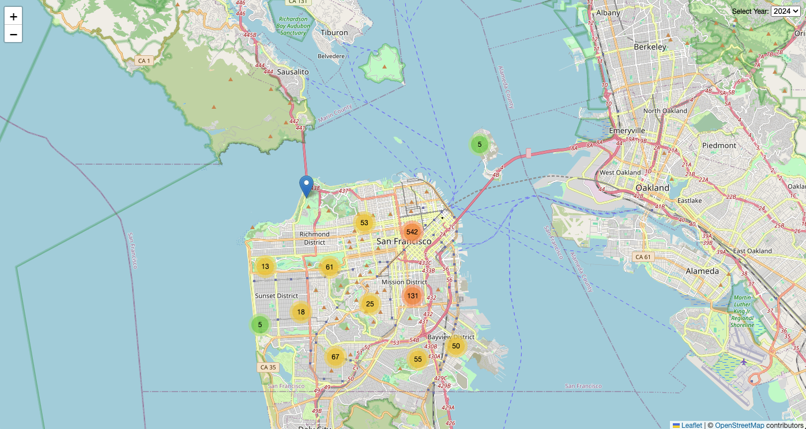
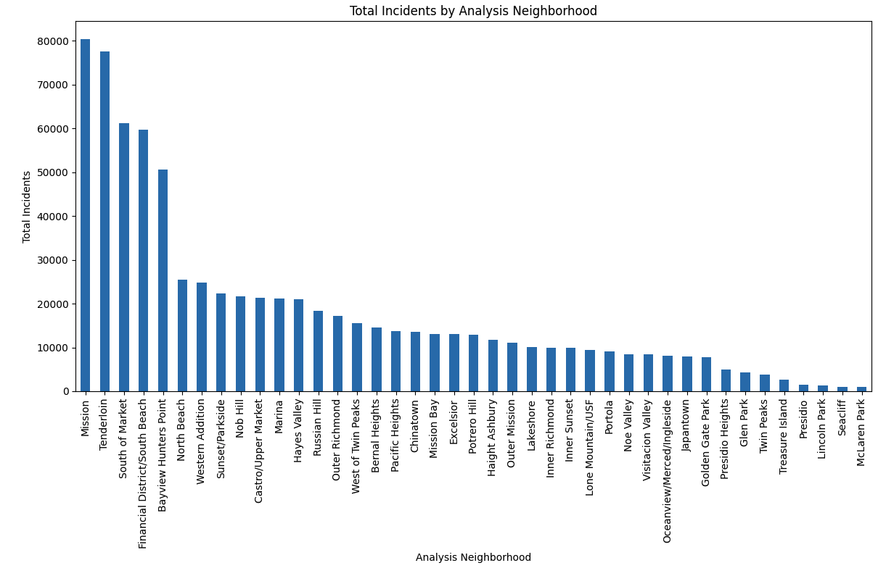
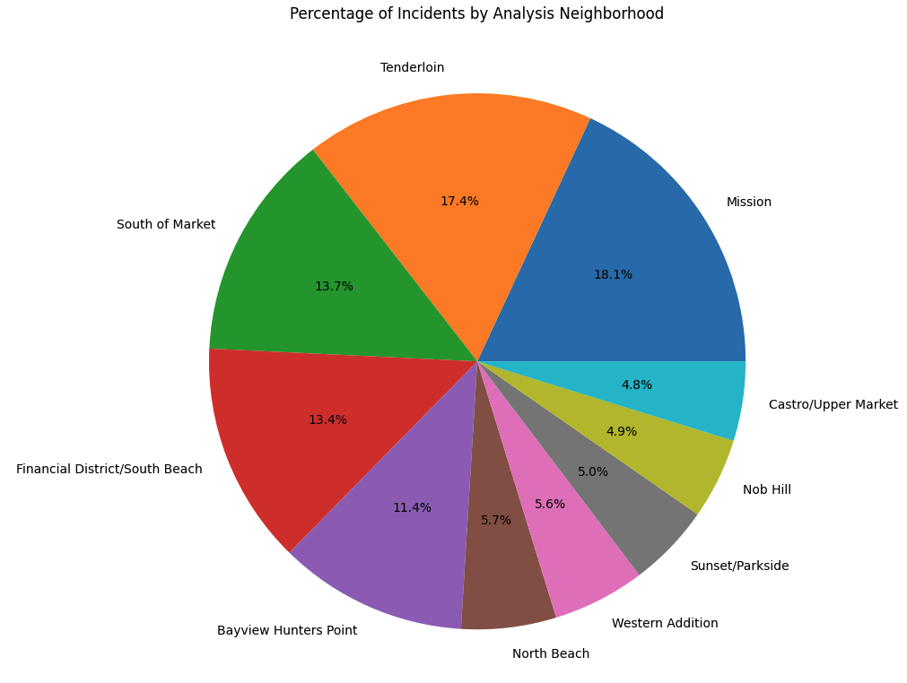

# Crime Patterns in Downtown San Francisco

## Instructions
After cloning the repository, open the 'data' folder → 
Select 'Police_Department_Incident_Reports.zip', expanding the file to → 'Police_Department_Incident_Reports.csv'

1. Run analysis/crime_db.ipynb for cleaned database creation
2. Run analysis/analysis.ipynb for crime_db analysis results and visualizations
3. In terminal, run 'python app.py' to launch flask app

### Data Source
[**The San Francisco Police Department’s (SFPD) Incident Report Dataset**](https://data.sfgov.org/Public-Safety/Police-Department-Incident-Reports-2018-to-Present/wg3w-h783/data_preview) 

**Data is compiled from the department’s Crime Data Warehouse (CDW)*
→ Provides information on incident reports filed by the SFPD in CDW, or filed by the public with the SFPD

→ Data is updated daily 10:00am PST
* Code accurately accounts for new data as source is updated

Data featured on the Map is accessed through an API endpoint, in JSON format, with results limited to a sample of 1000 rows

#### Overview
Following the 2020 pandemic, San Francisco has seen a steady rise in crime throughout the city. Using data on SF incident reports provided by SFPD and compiled from the department's Crime Data Warehouse, we analyzed crime patterns within downtown San Francisco neighborhoods, prior to, and following the pandemic. This code can be altered and used to reproduce similar results from other city data. 

Provided are visualizations to help demonstrate the types of crime that are most prevalent, the areas in which crime occurs, the time of day when crime is most prevalent, and the overall change in crime rate from 2018 - present day.

##### Research Questions
1. What are the safest neighborhoods in San Francisco? What are the least safe?
2. How has overall crime in San Francisco changed since 2018? 
    a. Are different incidents more common now, than they were prior to 2020?
3. What types of crime are most common throughout the city? 
4. What time of day is crime most prevalent? What day of week is crime most prevalent?
5. What is the resolution rate?
    a. Does this differ amongst the various neighborhoods?
    b. Does the type of crime have an effect on this?
    c. Has this changed over time?

### Visualizations
#### San Francisco Crime Map
* Displays markers of incident reports from SF Data's GeoJSON API (1000 record limit)
* Control created for toggling through data filtered by year (2019-2024)

* Hovering over marker clusters will reveal the neighborhood's boundary outline
* Once clicked, the marker will display details on that specific incident report

#### Least Safe Neighborhoods
##### Bar Chart - Overall Incident Count by Neighborhood
 
 ##### Pie Chart - Highest Percentage of Incidents by Neighborhood (Top 15)
 

#### Resources
Leaflet Marker Cluster Documentation: https://github.com/Leaflet/Leaflet.markercluster