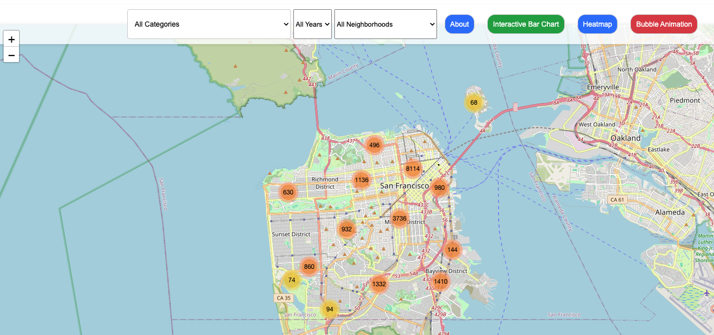

# Crime Analysis in the City of San Francisco
### Overview
Following the 2020 pandemic, San Francisco has seen a steady rise in crime throughout the city. Using data on SF incident reports provided by SFPD and compiled from the department's Crime Data Warehouse, we analyzed crime patterns within downtown San Francisco neighborhoods, prior to, and following the pandemic. 

This code can be altered and used to reproduce similar results from other city data. 

Provided are visualizations to help demonstrate the types of crime that are most prevalent, the areas in which crime occurs, the time of day when crime is most prevalent, and the overall change in crime rate from 2018 - present day.

#### Research Questions
1. What are the safest neighborhoods in San Francisco? What are the least safe?
2. How has overall crime in San Francisco changed since 2018? 
    a. Are different incidents more common now, than they were prior to 2020?
3. What types of crime are most common throughout the city? 
4. What time of day is crime most prevalent? What day of week is crime most prevalent?

## Instructions
**→ open: *'data'* folder**

**→ open: *'Police_Department_Incident_Reports.zip'*** 

**→ file expands to: *'Police_Department_Incident_Reports.csv'***

****Necessary to proceed with steps 1-4***

1. **Run analysis/data_cleaning.ipynb** to clean source data and export as a csv 
2. **In terminal, run 'pyton db.py'** to create MongoDB database and necessary collections.
3. **In terminal, run 'python app.py'** to launch the flask app and access the San Francisco Crime Dashboard.
4. **Run analysis/crime_analysis.ipynb** for research analysis, results, and related visualizations to the crime data.

### Data Source
[**The San Francisco Police Department’s (SFPD) Incident Report Dataset**](https://data.sfgov.org/Public-Safety/Police-Department-Incident-Reports-2018-to-Present/wg3w-h783/data_preview) 

Data is compiled from the department’s Crime Data Warehouse (CDW)

→ Provides information on incident reports filed by the SFPD in CDW, or filed by the public with the SFPD

→ Source data is updated daily 10:00am PST

**Code does NOT currently account for new data as source data is updated*

Data featured on the interactive city map is pulled from a random sample, stored and accessed using a MongoDB API endpoint

### Data Visualizations 
#### Flask App Design
* Web application for visualizing and serving data end points for crime data analysis
* Each page features a 'Back to Main Map' button, returning the user back to the homepage

##### Main Map View
* The 'homepage' of our Flask App, allows the user an interactive way to search for crime reports throughout the City of San Francisco 

 #### Navigation header 
 * Features drop down menus for further filtering marker clusters by crime category, year, and neighborhood
 * Includes navigation buttons to view the 'about' page and additional dynamic charts for analysis

 #### About Page - API Endpoints
 * Featured on the 'about' page is a list of API endpoints generated to reproduce data for each visualization

 #### Interactive Bar Chart
 * Allows user to sort through common crime categories, selecting and visualizing the historical change for each specific crime type included.

 #### Heat Map
 * Allows user to visualize the time of day when crime activity is considered 'extreme'

 #### Bubble Chart
 * Provides and animated way for the user to further visualize historical change for the selectected crime category

### San Francisco Crime Map
* Displays markers of incidents reported throughout the city
* Control created for toggling through data filtered by crime category

* Hovering over marker clusters will reveal the neighborhood's boundary outline
* Once clicked, the marker will display details on that specific incident report

### Static Visualizations Produced in Jupyter Notebook
#### Bar Chart
**Overall Incident Count by Neighborhood**
 

#### Pie Chart
**Highest Percentage of Incidents by Neighborhood**
 

#### Stacked Bar Chart
**Annual Crime Category Analysis**

#### Line Chart
**Annual Neighborhood Crime Analysis**

#### Box Plot
**Incident Time of Day Reported**

#### Box Plot
**Incident Day of Week Reported**

#### Heat Map
**Incident Time / Day of Week Reported**

## Contributors
Maddie Bowman - [maddiebowman](https://github.com/maddiebowman)
Jinlu Wang - [moonsunkey](https://github.com/moonsunkey)
Sakurako Kikuchi - [Sarah0215](https://github.com/Sarah0215)
Justin Bein - [SamDamon1942](https://github.com/SamDamon1942)
Brian Lee - [BrianLee0529](https://github.com/BrianLee0529)